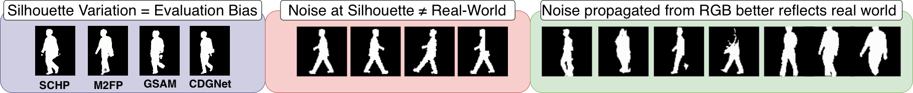
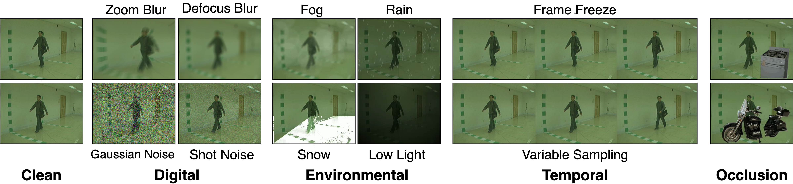

# RobustGait

Official repository of the WACV 2026 paper:

**RobustGait: Robustness Evaluation for Appearance-Based Gait Recognition**

This repository provides a framework to evaluate how appearance-based gait recognition models behave under realistic degradations.

Traditional robustness tests apply noise directly to silhouettes, which bypasses the effects of segmentation errors.
RobustGait instead applies noise at the RGB level, allowing distortions to naturally propagate through segmentation/parsing and into downstream gait models—better reflecting real-world deployment.



---

## Data Generation: Noise Pipeline and Silhouette Extraction

RobustGait provides a pipeline to:

- Generate **digital**, **environmental**, **temporal**, and **occlusion-based** perturbations  
- Apply **15 noise types × 5 severity levels** to RGB gait videos  
- Extract silhouettes after corruption using **any segmentation/parsing model**  (SCHP is provided as an example)

<p align="center">
  
</p>

See [prepare_data.md](robustgait_data_generation/prepare_data.md) for pipeline usage and dataset preparation.


---

## RobustGait Evaluation Framework

RobustGait extends **OpenGait** for robustness evaluation of gait recognition models.

Supported capabilities:

- Training gait models (GaitSet, GaitGL, GaitBase, DeepGaitV2, etc.)
- Evaluating under noisy/perturbed silhouette degradations
- Cross-parser and cross-gallery robustness testing
---

## Installation

```bash
python3 -m venv env
source env/bin/activate
pip install -r requirements.txt
```

---

## Dataset Variants

### Training Dataset Types

| Training Variant | Description |
|------------------|-------------|
| `Standard`       | Baseline training on clean/original silhouettes |
| `Augmented`      | Training on a mixture of clean + noisy silhouettes |
| `MultiModal`     | Training with both silhouette + RGB modalities |
| `MEVID`          | Training on MEVID tracklet-style dataset structure |

---

### Evaluation Gallery Variants

| Gallery Variant | Description |
|----------------|-------------|
| `NormalGallery` (default) | Standard OpenGait evaluation |
| `CleanGallery`            | Evaluate using clean gallery and noisy probe sequences |
| `PerturbedGallery`        | Robustness evaluation using both noisy/perturbed gallery and probe |

---


## Scripts

For detailed examples of training and evaluation under different robustness settings, please refer to:

```bash
scripts/robustness_eval.sh
```

---

## Acknowledgements

This repository borrows code from:

- [ShiqiYu/OpenGait](https://github.com/ShiqiYu/OpenGait)

---

## Citation

If you use RobustGait in your research, please cite our WACV 2026 paper (BibTeX coming soon).
